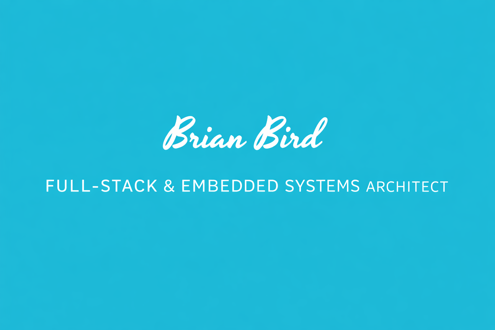

  

  <h1 style="font-family: 'Yesteryear', cursive; font-size:48px; margin-bottom: 10px;">Brian Bird</h1>
  
Full-Stack & Embedded Systems Architect

**Hey! Here's a bit about me:**
 
🛠️ Versatile Software Engineer with 11+ Years of End-to-End Cross-Platform App Development  
📜 Proud UNLV Alumni with a Graduate Degree  
🐛 Check out my website [here!](https://www.birdsoftware.dev)

---

## Current Projects

🛠️ <b>Independent Contractor for UNLV<b />, responsible for developing a web-based application to collect and visualize weather station data from local golf courses. The platform calculates evapotranspiration (ET₀) rates to optimize irrigation schedules, helping Las Vegas homeowners conserve water through more efficient landscape watering practices.
  
🛠️ Conference Navigator App – Custom interactive map and session manager used by 20,000+ attendees annually. 
<a href="https://www.viticusgroup.org/mobile-app">Conference App</a>
 

## Tools and Skills

 
<!--
## Completed Courses

🖥️ Computer Science I and II  
⚙ Introduction to Systems Programming  
🔍 Data Structures and Algorithms  
💿 Computer Organization  
💾 Operating Systems  
👨🏽‍💻 Programming Languages, Concepts, and Implementation  
🌎 Social Implications of Computer Technology  
🧠 Introduction to Machine Learning  
🎯 Analysis of Algorithms  
💡 Formal Language and Automata  
🧭 Compiler Construction  
🛜 Computer Networks  
ℹ️ Database Management Systems  

**omgdory/omgdory** is a ✨ _special_ ✨ repository because its `README.md` (this file) appears on your GitHub profile.

Here are some ideas to get you started:

- 🔭 I’m currently working on ...
- 🌱 I’m currently learning ...
- 👯 I’m looking to collaborate on ...
- 🤔 I’m looking for help with ...
- 💬 Ask me about ...
- 📫 How to reach me: ...
- 😄 Pronouns: ...
- ⚡ Fun fact: ...
-->
